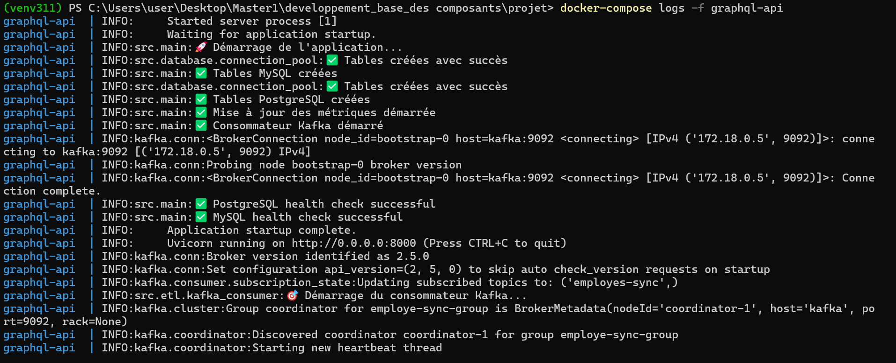
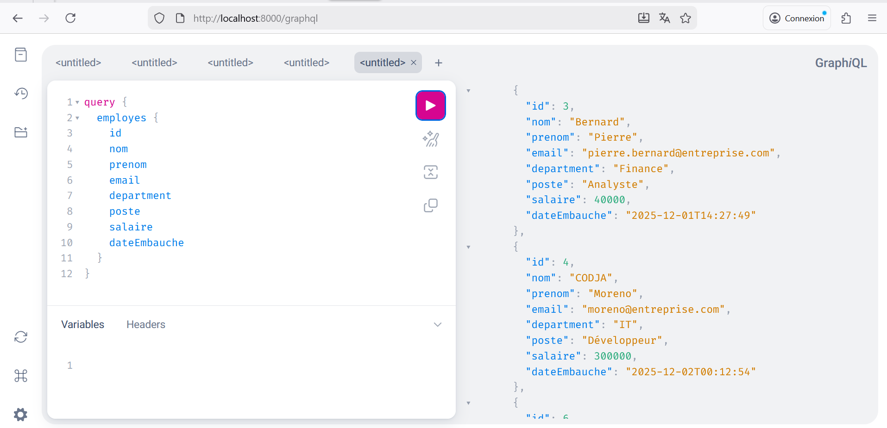
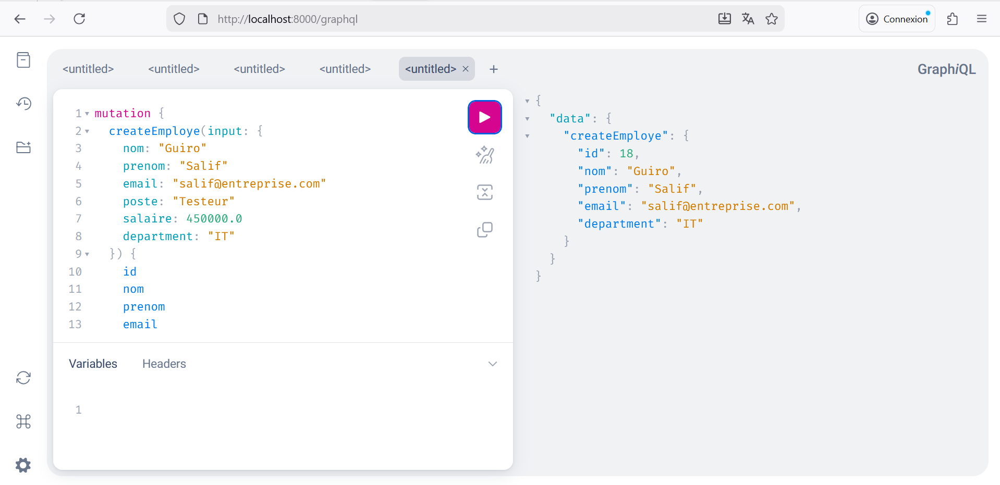
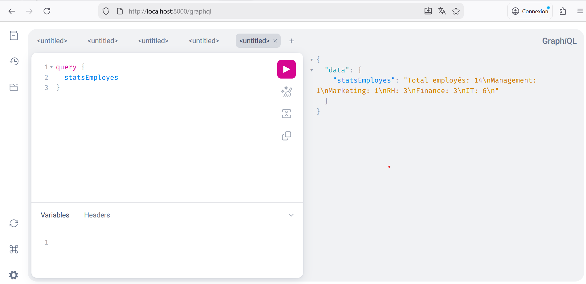
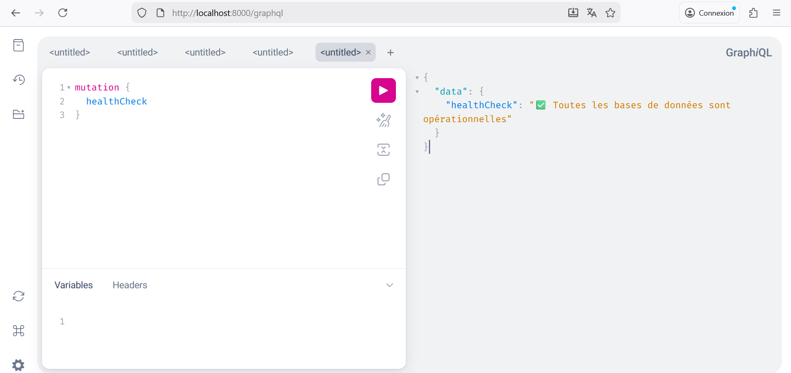
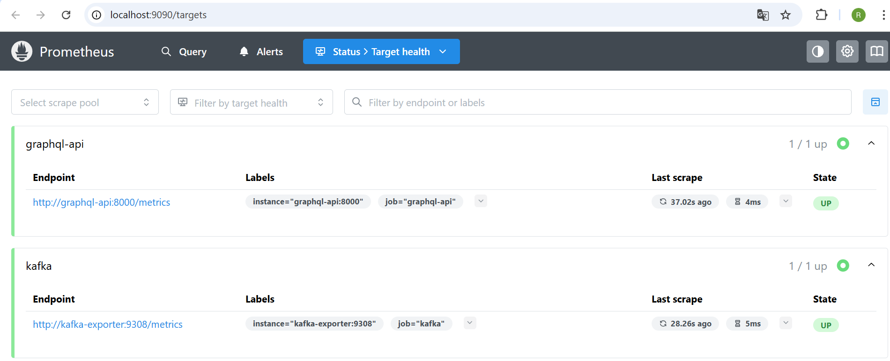
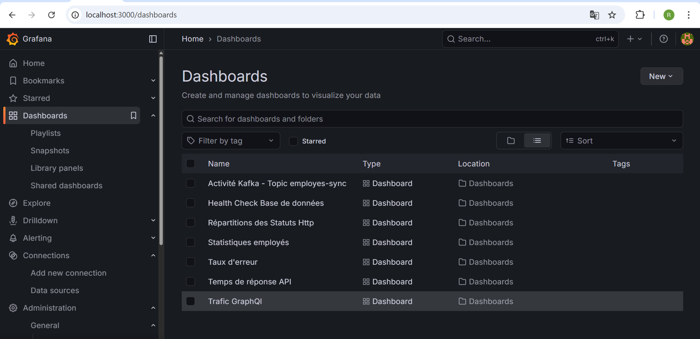
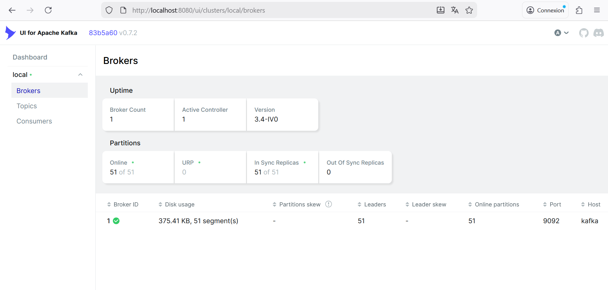
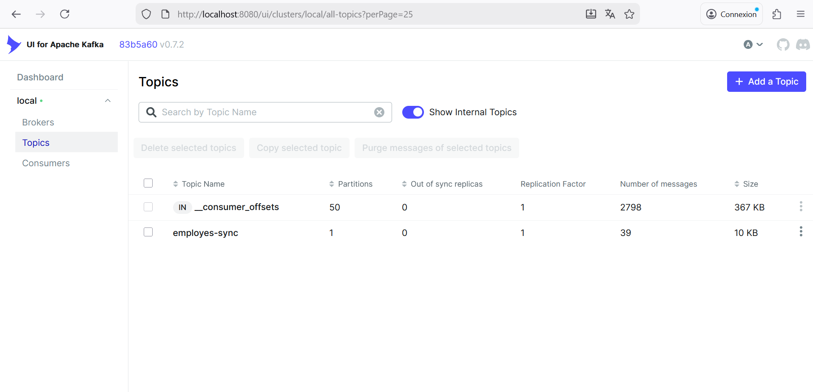
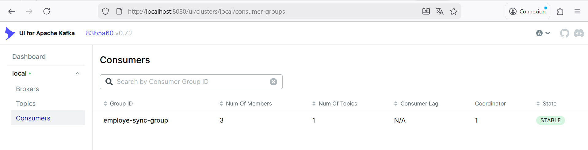

# 📸 GUIDE COMPLET D'INSTALLATION ET DE TEST
## Gestionnaire d'Employés avec GraphQL & Kafka 

<div align="center">

**Master 1 - Développement à Base des Composants**  
**Exercice 9: Service GraphQL avec Synchronisation ETL Kafka**

**Objectifs :**
- Créer une application Python pour gérer et afficher des données d'employés
- Utiliser Apache Kafka pour l'ETL et synchroniser les données entre deux bases de données
- Exposer les données synchronisées via une API GraphQL
- Surveiller les performances avec Prometheus et Grafana

**Tâches réalisées :**
- ✅ Application Python avec composants modulaires pour gérer les employés
- ✅ Pipeline ETL Kafka pour synchroniser les données entre MySQL et PostgreSQL
- ✅ API GraphQL (Strawberry) exposant les données synchronisées
- ✅ Monitoring complet avec Prometheus et Grafana
- ✅ Employés de test avec données réalistes

</div>

---

## 📋 TABLE DES MATIÈRES

1. [Prérequis & Vérification](#-prérequis--vérification-des-ports)
2. [Installation Docker Desktop](#-installation-docker-desktop)
3. [Configuration de l'environnement local](#-configuration-de-lenvironnement-local)
4. [Démarrage des services Docker](#-démarrage-des-services-docker)
5. [Vérification des services](#-vérification-des-services)
6. [Tests de l'application](#-tests-de-lapplication)
   - [Test GraphQL API](#-test-graphql-api)
   - [Test Prometheus Metrics](#-test-prometheus-metrics)
   - [Test Grafana Dashboards](#-test-grafana-dashboards)
   - [Test Kafka UI](#-test-kafka-ui)
   - [Test PostgreSQL](#-test-postgresql)
7. [Dépannage](#-dépannage)
8. [Checklist finale](#-checklist-finale)

---

## ✅ PRÉREQUIS & VÉRIFICATION DES PORTS

Avant de commencer, assurez-vous que:

- **Windows 11** avec PowerShell v5.1+
- **Python 3.11+** installé
- **Aucun logiciel** n'occupe les ports nécessaires

### **Vérifier les ports disponibles (Windows PowerShell)**

Exécuter les commandes suivantes pour vérifier que les ports sont libres:

```powershell
# Vérifier si les ports sont libres
netstat -ano | findstr ":8000"    # GraphQL API
netstat -ano | findstr ":3306"    # MySQL
netstat -ano | findstr ":5432"    # PostgreSQL
netstat -ano | findstr ":9092"    # Kafka
netstat -ano | findstr ":2181"    # Zookeeper
netstat -ano | findstr ":8080"    # Kafka UI
netstat -ano | findstr ":9090"    # Prometheus
netstat -ano | findstr ":3000"    # Grafana
```

⚠️ **Si un port est occupé**, arrêtez le service correspondant ou utilisez un port alternatif dans `docker-compose.yml`.

---

## 🐳 INSTALLATION DOCKER DESKTOP

### **Étape 1: Télécharger Docker Desktop**

1. **Windows**: https://www.docker.com/products/docker-desktop

<div align="center">
  
</div>

### **Étape 2: Installer sur Windows**

1. Double-cliquer sur `Docker Desktop Installer.exe`
2. Cocher "Add Docker to PATH"
3. Suivre l'assistant d'installation
4. **Redémarrer l'ordinateur** quand demandé


### **Étape 3: Vérifier l'installation**

Ouvrir **PowerShell** et exécuter:

```powershell
docker --version
# Résultat attendu: Docker version 29.0.1+ ✅

docker-compose --version
# Résultat attendu: Docker Compose version v2.20+  ✅

docker run hello-world
# Résultat attendu: "Hello from Docker!" ✅

python --version  
# Résultat attendu: Python 3.11.0+ ✅
```

---

## 💻 CONFIGURATION DE L'ENVIRONNEMENT LOCAL

### **Étape 1: Cloner ou ouvrir le projet**

```powershell
cd C:\chemin\vers\votre\projet
```

### **Étape 2: Créer l'environnement virtuel Python**

```powershell
python -m venv venv311
```

### **Étape 3: Activer l'environnement virtuel**

```powershell
.\venv311\Scripts\Activate.ps1
```

### **Étape 4: Installer les dépendances**

```powershell
pip install --upgrade pip
pip install -r requirements.txt
```

### **Étape 5: Créer le fichier .env (optionnel)**

Copier `.env.example` vers `.env` et adapter si nécessaire:

```powershell
cp .env.example .env
# Puis éditer .env pour vos valeurs locales (hosts Docker, mots de passe, etc.)
```

---

## 🚀 DÉMARRAGE DES SERVICES DOCKER

### **Étape 1: Construire et lancer tous les services**

```powershell
docker-compose build
docker-compose up -d
```

Résultat attendu:

```
✔ graphql-api                    Built                            0.0s 
✔ Network projet_monitoring      Created                          0.1s 
✔ Container projet-mysql-1       Started                          2.6s 
✔ Container projet-postgres-1    Started                          2.8s 
✔ Container projet-zookeeper-1   Started                          2.5s 
✔ Container projet-kafka-1       Started                          2.8s 
✔ Container graphql-api          Started                          3.0s
✔ Container projet-prometheus-1  Started                          2.5s
✔ Container projet-grafana-1     Started                          2.3s
✔ Container projet-kafka-ui-1    Started                          2.4s
```

### **Étape 2: Vérifier l'état des services**

```powershell
docker-compose ps
```

Tous les conteneurs doivent être **Up** (vert).

### **Étape 3: Vérifier les logs en temps réel**

```powershell
docker-compose logs -f graphql-api
```

Attendez le message `Application startup complete` ✅

<div align="center">
  
</div>

---

## ✔️ VÉRIFICATION DES SERVICES

Tous les services sont accessibles aux URLs suivantes:

| Service | URL | Identifiants |
|---------|-----|--------------|
| **GraphQL API** | http://localhost:8000/graphql | N/A |
| **Prometheus** | http://localhost:9090 | N/A |
| **Grafana** | http://localhost:3000 | admin / grafana@ |
| **Kafka UI** | http://localhost:8080 | N/A |
| **MySQL** | localhost:3306 | root / root |
| **PostgreSQL** | localhost:5432 | postgres / postgres |


---

## 🧪 TESTS DE L'APPLICATION

### 🔷 TEST GRAPHQL API

#### **Accéder à GraphQL**

1. Ouvrir le navigateur: **http://localhost:8000/graphql**
2. L'interface Apollo GraphQL s'affiche

#### **Test 1: Récupérer la liste des employés**

Copier-coller dans le panel gauche:

```graphql
query {
  employes {
    id
    nom
    prenom
    email
    department
    poste
    salaire
    dateEmbauche
  }
}
```

Appuyer sur **▶️ Play** → Les employés s'affichent dans le panel droit ✅

<div align="center">
  
</div>

#### **Test 2: Créer un nouvel employé**

```graphql
mutation {
  createEmploye(input: {
    nom: "Guiro"
    prenom: "Salif"
    email: "salif@entreprise.com"
    poste: "Testeur"
    salaire: 450000.0
    department: "IT"
  }) {
    id
    nom
    prenom
    email
    department
  }
}
```

Résultat: Nouvel employé créé dans MySQL ✅

<div align="center">
  
</div>

#### **Test 3: Mettre à jour un employé**

```graphql
mutation {
  updateEmploye(id: 1, input: {
    nom: "Moussa"
    prenom: "Sow"
    email: "sow@entreprise.com"
    poste: "Ingénieur"
    salaire: 500000.0
    department: "Marketing"
  }) {
    id
    nom
    prenom
    email
    department
  }
}
```

Résultat: Employé n°1 mis à jour ✅

#### **Test 4: Obtenir les statistiques**

```graphql
query {
  statsEmployes
}
```

Résultat: Total employés et décomposition par département ✅

<div align="center">
  
</div>

#### **Test 5: Supprimer un employé**

```graphql
mutation {
  deleteEmploye(id: 2)
}
```

Résultat: Employé n°2 supprimé de MySQL ✅

#### **Test 6: Vérifier la santé du système**

```graphql
query {
  healthCheck
}
```

Résultat: État du système complet ✅

<div align="center">
  
</div>

---

### 📊 TEST PROMETHEUS METRICS

1. Ouvrir: **http://localhost:9090**
2. Onglet **Status** → **Targets**
3. Vérifier que `graphql-api:8000` est **UP** (vert) ✅

<div align="center">
  
</div>

---

### 📈 TEST GRAFANA DASHBOARDS

1. Ouvrir: **http://localhost:3000**
2. Se connecter: **admin** / **grafana@**
3. Consulter les dashboards créés

<div align="center">
  
</div>

---

### 🧠 TEST KAFKA UI

1. Ouvrir: **http://localhost:8080**
2. Vérifier **Cluster** et ses statuts ✅

#### **Consulter les Brokers**

Cliquer sur **Brokers** → Voir les informations Kafka:

<div align="center">
  
</div>

#### **Consulter les Topics**

Cliquer sur **Topics** → Voir les topics, partitions et messages:

<div align="center">
  
</div>

#### **Consulter les Consumer Groups**

Cliquer sur **Consumer Groups** → Voir les consumers actifs:

<div align="center">
  
</div>

---

### 🗄️ TEST POSTGRESQL

Accéder à PostgreSQL via CLI:

```powershell
docker exec -it projet-postgres-1 psql -U postgres -d entreprise
```

Vérifier les données synchronisées:

```sql
SELECT * FROM employes;
```

Résultat: Tous les employés créés dans MySQL sont présents dans PostgreSQL ✅

---

## 🩺 DÉPANNAGE

### **Problèmes courants et solutions**

| Erreur | Cause | Solution |
|--------|-------|----------|
| **MySQL refuse connexion** | Volume corrompu | `docker volume rm projet_mysql_data` puis relancer |
| **PostgreSQL refuse connexion** | Volume non vide | `docker volume rm projet_postgres_data` puis relancer |
| **Kafka NoBrokersAvailable** | Mauvais hostname | Vérifier `KAFKA_BOOTSTRAP_SERVERS=kafka:9092` |
| **API inaccessible sur :8000** | Port occupé | `netstat -ano \| findstr ":8000"` puis libérer |
| **Prometheus ne scrape pas** | Service non accessible | Vérifier que `graphql-api` est `Up` |
| **Grafana pas de datasource** | Prometheus non trouvé | URL: `http://prometheus:9090` |
| **Kafka UI ne se lance pas** | Port 8080 occupé | Changer port dans `docker-compose.yml` |

### **Commandes utiles**

```powershell
# Arrêter tous les services
docker-compose down

# Supprimer les volumes de données
docker volume rm projet_mysql_data projet_postgres_data prometheus_data

# Relancer complètement (ATTENTION: perte de données!)
docker-compose down -v
docker-compose up -d

# Voir les logs d'un service spécifique
docker-compose logs graphql-api
docker-compose logs kafka
docker-compose logs mysql

# Accéder à un conteneur
docker exec -it graphql-api bash
docker exec -it projet-mysql-1 mysql -u root -proot

# Vérifier les networks et volumes
docker network ls
docker volume ls
```

---

## 📚 TECHNOLOGIQUE ET OUTILS UTILISES

### **Backend & API**
- **Python 3.11** - Langage principal
- **FastAPI 0.100.0** - Framework API
- **Strawberry GraphQL 0.187.0** - Implémentation GraphQL
- **SQLAlchemy 1.4.46** - ORM Database
- **Pydantic 1.10.12** - Validation données
- **Prometheus Client 0.17.1** - Métriques monitoring

### **Bases de données & Messaging**
- **MySQL 8.0** - Base de données source
- **PostgreSQL 13** - Base de données destination
- **Apache Kafka 7.4.0** - Message broker pour ETL
- **Zookeeper 7.4.0** - Coordination Kafka
- **kafka-python 2.0.2** - Client Python
- **confluent-kafka 2.12.2** - Client Kafka avancé
- **PyMySQL 1.1.0** - Connecteur MySQL
- **Psycopg2 2.9.7** - Connecteur PostgreSQL

### **Infrastructure & Monitoring**
- **Docker 24+** - Conteneurisation
- **Docker Compose 2.20+** - Orchestration
- **Prometheus** - Collecte métriques
- **Grafana** - Visualisation dashboards
- **Kafka UI** - Interface Kafka

---

  
**Date:** Décembre 2025  
**Classe:** Master 1 - Développement à Base des Composants